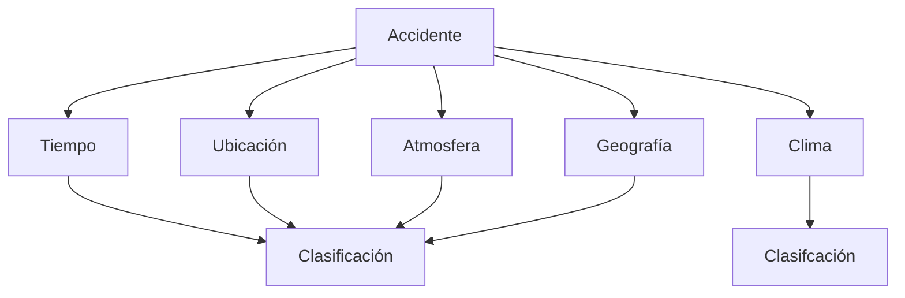

## **Tarea 01 - Preliminares**

 

### Facultad de Ciencias Fisico Matematicas, UANL
### Maestría en Ciencia de Datos
### Base de Datos Relacionales

#### Profr. Alberto Benavides
#### Victor Sanchez

Descripción de una base de datos:  

Se requiere dar un seguimiento detallado a los accidentes automovilisticos acontecidos en Estados Unidos de Ámerica durante el periodo Febrero 2016 a Diciembre 2021. Dentro de los aspectos relevantes a registrar se encuentran: el tiempo en el que se desarrolló el accidente, marcado por un momento de inicio y fin; la dirección y coordenadas geograficas del suceso, así como el entorno geografico que rodea al lugar de los hechos (señales de transito y estructuras viales). Además, deberán registrarse las condiciones climaticas y atmosfericas del lugar con el fin de obtener mayor detalle del incidente observado. Finalmente, en una escala del 1 al 4 se clasificará la gravedad del accidente en el trafico, donde 1 representa un menor impacto y 4 un impacto significativo.

De forma grafica, la relación de los atributos está dada de la siguiente manera:

Se enlistan los atributos que deberá contener la base a trabajar:

- Tiempo
    - Inicio (fecha y hora)
    - Fin (fecha y hora)
    - Zona horaria (Texto)
    - Marca de registro (fecha y hora)
- Ubicación 
    - Descripción (Texto)
    - Latitud (Número)
    - Longitud (Número)
    - Distancia (Número)
    - Número calle (Número)
    - Calle (Texto)
    - Lado calle (Texto)
    - Ciudad (Texto)
    - Condado (Texto)
    - Estado (Texto)
    - Código Postal (Número)
    - País (Número)
    - Código Aeropuerto (Número)
- Condiciones climaticas y atmosfericas
    - Temperatura (Número)
    - Sensación térmica (Número)
    - Humedad (Número)
    - Presión del aire (Número)
    - Visibilidad (Número)
    - Dirección del viento (Texto)
    - Velocidad del viento (Número)
    - Precipitación (Número)
    - Condición meteorologica (Texto)
- Entorno Geográfico
    - Amenidad (Texto)
    - Joroba (Texto)
    - Cruce 1 (Texto)
    - Ceder el paso (Texto)
    - Cruce 2 (Texto)
    - Sin salida 
    - Vías Ferreas (Texto)
    - Rotonda
    - Estación
    - Parada
    - Reductor de velocidad 
    - Semáforo
    - Giro
- Clasificación
    - Identificador
    - Severidad

