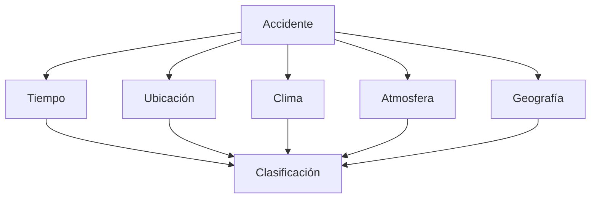

## **Tarea 01 - Preliminares**

 

### Facultad de Ciencias Fisico Matematicas, UANL
### Maestría en Ciencia de Datos
### Base de Datos Relacionales

#### Profr. Alberto Benavides
#### Victor Sanchez

Descripción de una base de datos:  

Se requiere dar un seguimiento detallado a los accidentes automovilísticos acontecidos en Estados Unidos de América durante el periodo Febrero 2016 a Diciembre 2021. Dentro de los aspectos relevantes a registrar se encuentran: el tiempo en el que se desarrolló el accidente, marcado por un momento de inicio y fin; la dirección y coordenadas geográficas del suceso, así como el entorno geográfico que rodea al lugar de los hechos (señales de tránsito y estructuras viales). Además, deberán registrarse las condiciones climáticas y atmosféricas del lugar con el fin de obtener mayor detalle del incidente observado. Finalmente, en una escala del 1 al 4 se clasificará la gravedad del accidente en el tráfico, donde 1 representa un menor impacto y 4 un impacto significativo.

De forma gráfica, la relación de los atributos está dada de la siguiente manera:

Se enlistan los atributos que deberá contener la base a trabajar:

- Tiempo
    - Inicio (fecha y hora)
    - Fin (fecha y hora)
    - Zona horaria (Texto)
    - Marca de registro (fecha y hora)
- Ubicación 
    - Descripción (Texto)
    - Latitud (Número)
    - Longitud (Número)
    - Distancia (Número)
    - Número calle (Número)
    - Calle (Texto)
    - Lado calle (Texto)
    - Ciudad (Texto)
    - Condado (Texto)
    - Estado (Texto)
    - Código Postal (Número)
    - País (Número)
    - Código Aeropuerto (Número)
- Condiciones climáticas y atmosféricas
    - Temperatura (Número)
    - Sensación térmica (Número)
    - Humedad (Número)
    - Presión del aire (Número)
    - Visibilidad (Número)
    - Dirección del viento (Texto)
    - Velocidad del viento (Número)
    - Precipitación (Número)
    - Condición meteorológica (Texto)
- Entorno Geográfico
    - Amenidad (Texto)
    - Joroba (Texto)
    - Cruce 1 (Texto)
    - Ceder el paso (Texto)
    - Cruce 2 (Texto)
    - Sin salida (Texto)
    - Vías Férreas (Texto)
    - Rotonda (Texto)
    - Estación (Texto)
    - Parada (Texto)
    - Reductor de velocidad (Texto)
    - Semáforo (Texto)
    - Giro (Texto)
- Clasificación
    - Identificador (Texto)
    - Severidad (Número)

Selección de un SGBD 😊:

De todas las opciones de SGBDs, he seleccionado _Microsoft SQL Server_ debido a la interacción previa que he tenido con esta herramienta a traves de los servidores de la empresa donde laboro. Una de las principales caracteristicas que me agradan de este sistema es su proceso de control, tomandose la libertad de compartir y restringir la visualización de información y datos a clientes y usuarios, esto es muy importante para empresas que requieran procesos de huella de auditoría o un seguimiento de movimientos en sus herramientas donde alojan información confidencial.
En temas de lenguaje, utiliza _SQL_ y además extiende la programación a traves de un modulo llamado _Transact-SQL_, que añadé más opciones y comandos exclusivos de este sistema. Muy similar a varios SGBD trabaja bajo una estructura de tablas basadas en filas que a su vez conectan elementos.
Si bien mencioné que ya tengo interacción con _Microsoft SQL Server_ considero que me falta explotar aún más todos sus recursos, es por ello que me gustaría trabajar la base de datos de accidentes automovilísticos en este sistema.

FIN 💻