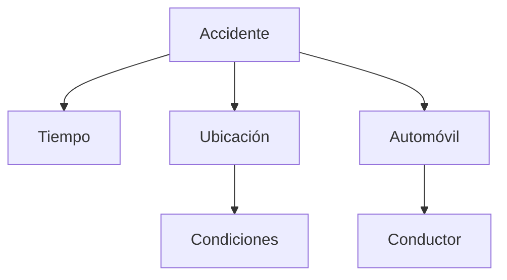

## **Tarea 01 - Preliminares**

 

### Facultad de Ciencias Fisico Matematicas, UANL
### Maestría en Ciencia de Datos
### Base de Datos Relacionales

#### Profr. Alberto Benavides
#### Victor Sanchez

Descripción de una base de datos:  

Se requiere dar seguimiento  a los [accidentes automovilísticos](https://www.kaggle.com/datasets/sobhanmoosavi/us-accidents) acontecidos en Estados Unidos de América durante el periodo Febrero 2016 a Diciembre 2021. Dentro de las aspectos relevantes a registrar se encuentran: el tiempo en el que se desarrolló el accidente, marcado por un momento de inicio y fin, así como la ubicación del suceso. Además, deberán registrarse las condiciones climáticas y atmosféricas del lugar con el fin de obtener mayor detalle del incidente observado. Finalmente, se tomarán datos referentes al automóvil y conductor participe en cada uno de los accidentes.

De forma gráfica, la relación de la base anterior descrita está dada de la siguiente manera:

Se enlistan los tablas que deberá contener la base a trabajar:

- Tiempo
    - Id accidente (Texto)
    - Inicio (Fecha y hora)
    - Fin (Fecha y hora)
    - Zona horaria (Texto)
- Ubicación
    - Id accidente (Texto)
    - Id ubicación (Texto)
    - Latitud (Número)
    - Longitud (Número)
    - Número calle (Número)
    - Calle (Texto)
    - Ciudad (Texto)
    - Condado (Texto)
    - Estado (Texto)
    - Código Postal (Número)
    - País (Número)
- Condiciones
    - Id accidente (Texto)
    - Id ubicación (Texto)
    - Temperatura (Número)
    - Sensación térmica (Número)
    - Humedad (Número)
    - Presión del aire (Número)
    - Dirección del viento (Texto)
    - Velocidad del viento (Número)
    - Precipitación (Número)
    - Meteorología (Texto)
- Automóvil
    - Id accidente (Texto)
    - Id carro (Texto)
    - Color (Texto)
    - Tipo (Texto)
    - Número pasajeros (Número)
- Conductor
    - Id carro (Texto)
    - Fecha nacimiento conductor (Fecha)

Selección de un SGBD 😊:

De todas las opciones de SGBDs, he seleccionado _Microsoft SQL Server_ debido a la interacción previa que he tenido con esta herramienta a traves de los servidores de la empresa donde laboro. Una de las principales caracteristicas que me agradan de este sistema es su proceso de control, tomandose la libertad de compartir y restringir la visualización de información y datos a clientes y usuarios, esto es muy importante para empresas que requieran procesos de huella de auditoría o un seguimiento de movimientos en sus herramientas donde alojan información confidencial.
En temas de lenguaje, utiliza _SQL_ y además extiende la programación a traves de un modulo llamado _Transact-SQL_, que añadé más opciones y comandos exclusivos de este sistema. Muy similar a varios SGBD trabaja bajo una estructura de tablas basadas en filas que a su vez conectan elementos.
Si bien mencioné que ya tengo interacción con _Microsoft SQL Server_ considero que me falta explotar aún más todos sus recursos, es por ello que me gustaría trabajar la base de datos de accidentes automovilísticos en este sistema.

Un sistema similar al que seleccioné es _Oracle_, cuenta con varias ventajas a comparación de _SQL Server_, entre ellas un proceso más sencillo de recuperación de datos, se pueden manejar bases de datos más grandes y es compatible con cualquier sistema operativo, situación que no sucede con _SQL Server_

FIN 💻