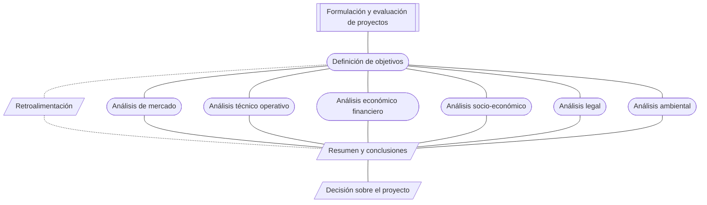

## **Tarea 02 - Modelo E-R**

 

### Facultad de Ciencias Fisico Matematicas, UANL
### Maestría en Ciencia de Datos
### Base de Datos Relacionales

#### Profr. Alberto Benavides
#### Victor Sanchez

Diagrama Entidad - Relación: 

Para la [base establecida](https://github.com/VicoSan07/EjemploBD/blob/main/tarea1.md) para el registro de accidentes automovilísticos en Estados Unidos, se muestra su diagrama e-r correspondiente:

