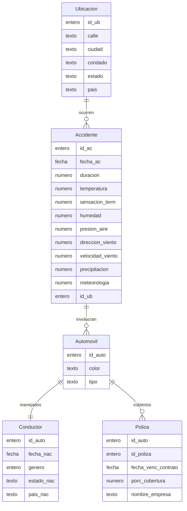

## **Tarea 02 - Modelo E-R**

 

### Facultad de Ciencias Fisico Matematicas, UANL
### Maestría en Ciencia de Datos
### Base de Datos Relacionales

#### Profr. Alberto Benavides
#### Victor Sanchez

Modelo relacional

Respecto a la [base establecida](https://github.com/VicoSan07/EjemploBD/blob/main/tarea1.md) para el registro de accidentes automovilísticos en Estados Unidos, se muestra el esquema de su modelo relacional correspondiente:

---------------------------------------------------------
Ubicación (id_ub, calle, ciudad, condado, estado, país)

Accidente (id_ac, fecha_ac, duracion, temperatura, sensación_term, húmedad, presión_aire, dirección_viento, velocidad_viento, precipitación, meteorología, id_ub)

Automovil (id_auto, color, tipo)

Conductor (id_auto, fecha_nac, género, estado_nac, país_nac)

Póliza (id_auto, id_poliza, nombre_empresa, fecha_venc, porc_cobertura)

---------------------------------------------------------

**Notas**:
1. En una ubicación pueden acontecer varios accidentes
2. En un accidente pueden involucrarse varios automóviles
3. Un automóvil solo tiene un conductor
4. Un automóvil puede estar asegurado por varias pólizas, pero una póliza no puede asegurar varios autos. 

El esquema anterior, puede ser representado a tráves del siguiente diagrama relacional:

